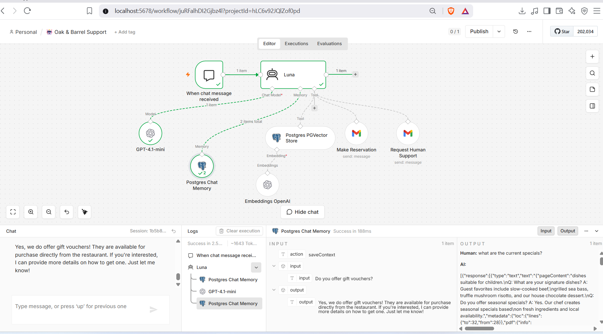
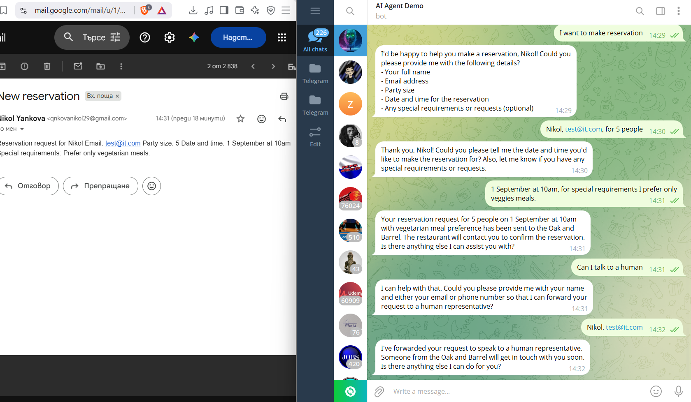
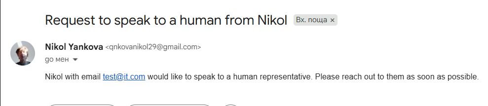
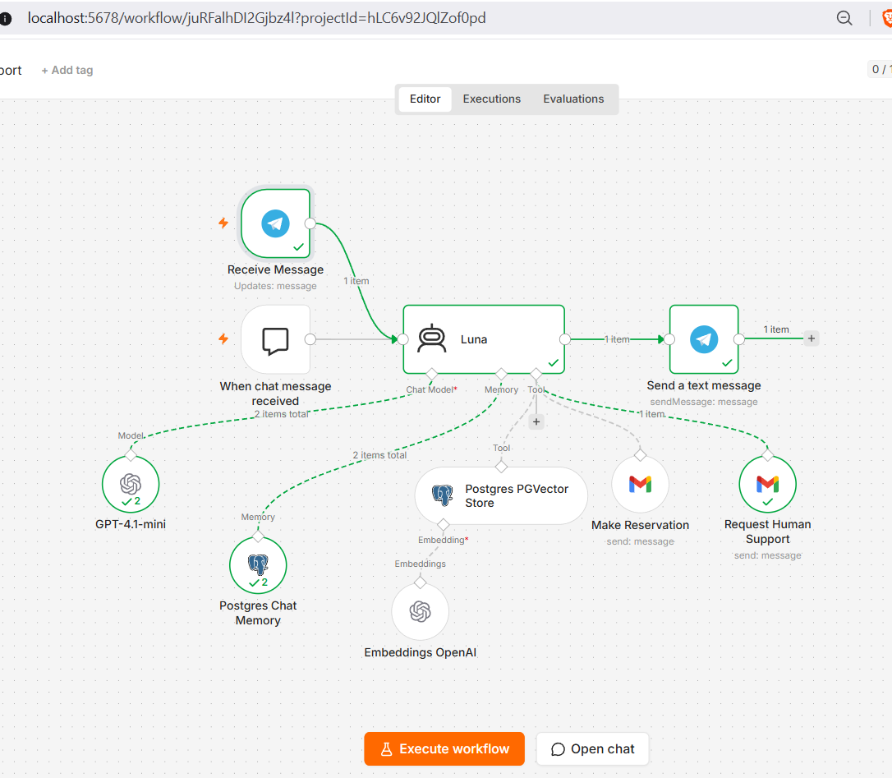

# AI Restaurant Agent - Oak & Barrel

An AI-powered customer support agent for the **Oak & Barrel** restaurant, built with **n8n**.

The agent can:

* Answer questions about the restaurant using a **RAG-based knowledge base**
* Make reservation requests for customers
* Request human support when a customer wants to be contacted by a restaurant representative
* Maintain conversation context using **PostgreSQL Chat Memory**
* Communicate with customers through **Telegram**

## Architecture

The project is separated into two workflows:

### 1. Knowledge Base Ingestion Workflow

This workflow is responsible for populating and updating the restaurant's knowledge base.

`File Upload → Data Loader → OpenAI Embeddings → PostgreSQL + pgvector`

Uploaded restaurant information is processed by the data loader, converted into vector embeddings using **OpenAI Embeddings**, and stored in **PostgreSQL with the pgvector extension, hosted on Supabase**.

### 2. AI Restaurant Agent Workflow

This is the main customer-facing workflow.

`Customer Message → AI Agent → Tools → Response`

The AI agent uses the PostgreSQL vector store as a retrieval tool. When a customer asks a question, the agent performs a semantic search over the restaurant knowledge base and uses the retrieved information as context for generating a relevant response.

The agent also has access to tools for:

* **Knowledge retrieval** - PostgreSQL + pgvector
* **Conversation memory** - PostgreSQL Chat Memory
* **Reservation requests** - Gmail integration
* **Human support requests** - Gmail integration

This separation keeps **knowledge ingestion** independent from **runtime retrieval and customer interaction**.

## Persistent Storage & Vector Search

The project uses **PostgreSQL hosted on Supabase** for persistent storage instead of relying only on n8n's in-memory storage.

### PGVector Knowledge Base

The restaurant knowledge base is stored in **PostgreSQL with the pgvector extension**, hosted on **Supabase**.

Restaurant documents are converted into embeddings using **OpenAI Embeddings** and stored in the PGVector store. The AI agent can then perform semantic similarity searches to retrieve relevant information when answering customer questions.

```text
Restaurant Documents
        ↓
    Data Loader
        ↓
 OpenAI Embeddings
        ↓
Supabase PostgreSQL + pgvector
        ↑
   Semantic Search
        ↑
     AI Agent
```

### Persistent Chat Memory

The agent uses **PostgreSQL Chat Memory** to persist conversation history.

Unlike **Simple Memory**, which keeps conversation state in memory and may lose it when the n8n instance or server is restarted, PostgreSQL-backed memory stores the conversation history persistently in the database.

```text
Simple Memory
n8n memory → Server restart → History lost

PostgreSQL Chat Memory
AI Agent → PostgreSQL → Server restart → History preserved
```

The PostgreSQL database therefore serves two different purposes:

* **PGVector Store** - stores the restaurant knowledge base and vector embeddings used for RAG.
* **PostgreSQL Chat Memory** - stores conversation history used to maintain context between customer messages.

## Tech Stack

* **n8n** - workflow automation and AI agent orchestration
* **OpenAI** - LLM and text embeddings
* **PostgreSQL + pgvector** - vector storage and semantic search
* **Supabase** - managed PostgreSQL hosting
* **Telegram** - customer communication
* **Gmail** - reservation and human support requests
* **Docker** - local n8n environment
* **ngrok** - secure tunnel for exposing the local n8n instance to external webhooks

## RAG Flow

```text
                    ┌──────────────────────────┐
                    │   Restaurant Documents   │
                    └────────────┬─────────────┘
                                 ↓
                         OpenAI Embeddings
                                 ↓
                    ┌──────────────────────────┐
                    │ PostgreSQL + pgvector    │
                    │       Supabase           │
                    └────────────┬─────────────┘
                                 ↑
                          Semantic Search
                                 ↑
Customer → Telegram → AI Agent ──┼──→ Restaurant Answer
                                 │
                                 ├──→ Make Reservation
                                 │
                                 └──→ Request Human Support
```







