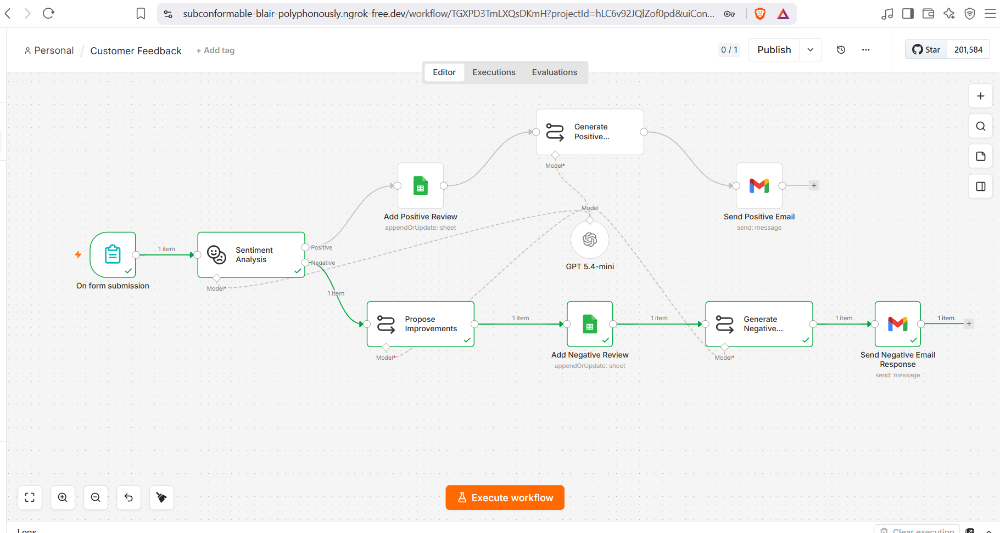
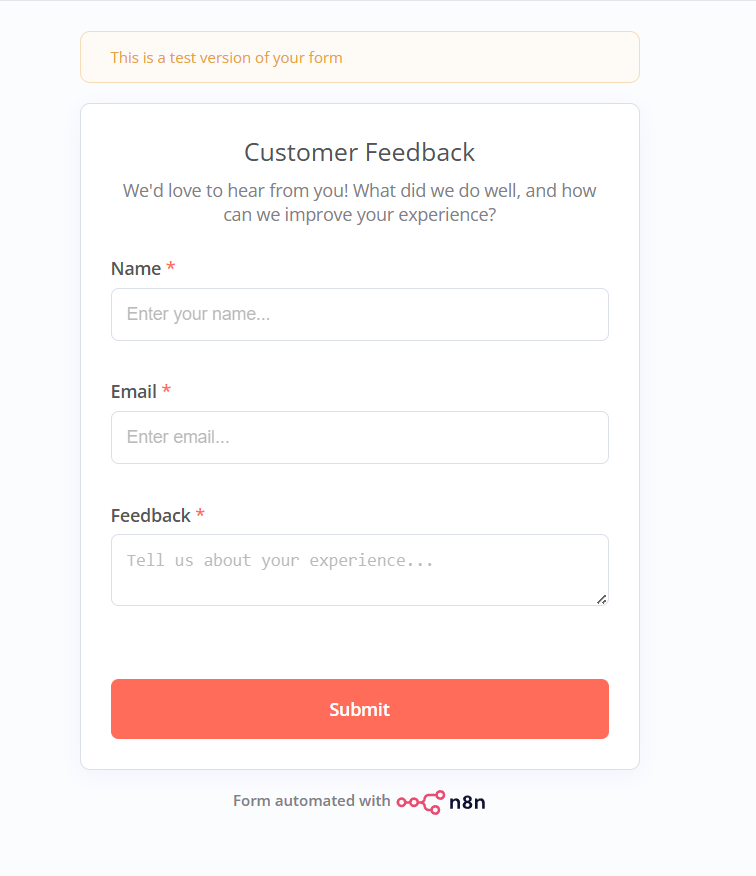
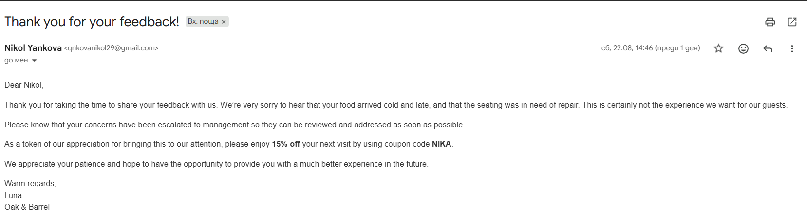
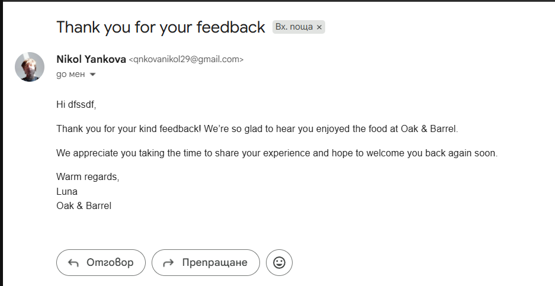
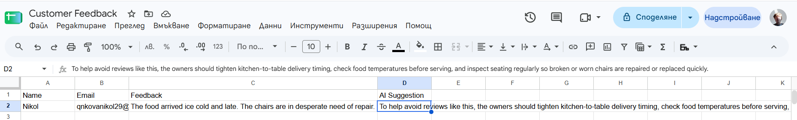

# AI Customer Feedback Automation

An AI-powered customer feedback processing workflow built with **n8n**.

The workflow collects customer feedback through an **n8n Form**, automatically analyzes its sentiment, stores the feedback in **Google Sheets**, and generates a personalized email response using an **LLM**.

For negative feedback, the system also analyzes the customer's concerns and generates actionable suggestions for improving the business.

## Features

* Collect customer feedback through an **n8n Form**
* Classify feedback as **positive or negative** using AI sentiment analysis
* Route feedback automatically based on its sentiment
* Store reviews in separate **Google Sheets**
* Generate AI-powered email responses
* Generate **business improvement suggestions** for negative feedback
* Send personalized responses automatically through **Gmail**

## Workflow

```text
                         ┌── Positive ──→ Google Sheets
                         │                    ↓
Customer → n8n Form → Sentiment Analysis   AI Response
                         │                    ↓
                         │                  Gmail
                         │
                         └── Negative ──→ AI Improvement Suggestions
                                              ↓
                                         Google Sheets
                                              ↓
                                         AI Response
                                              ↓
                                            Gmail
```

## How It Works

### 1. Customer Feedback Collection

The workflow starts with an **n8n Form** where customers can provide:

* Name
* Email address
* Feedback

Submitting the form automatically triggers the workflow.

### 2. AI Sentiment Analysis

The submitted feedback is passed to an **LLM**, which analyzes the review and classifies its sentiment as either:

* **Positive**
* **Negative**

The workflow then follows a different branch depending on the result.

### 3. Positive Feedback

When feedback is classified as positive, the workflow stores the following information in the **Positive** Google Sheet:

```text
Name | Email | Feedback
```

An LLM then generates a personalized response based on the customer's feedback.

The generated response is automatically sent to the customer using the **Gmail** node.

```text
Positive Review
      ↓
Google Sheets
      ↓
AI-generated Response
      ↓
Gmail
```

### 4. Negative Feedback

Negative feedback goes through an additional AI analysis step.

The LLM analyzes the customer's complaint and generates an **actionable improvement suggestion** that the business could use to address the reported problem.

The workflow then stores the following information in the **Negative** Google Sheet:

```text
Name | Email | Feedback | AI Suggestion
```

For example, if a customer reports that the food arrived cold and that the chairs need repair, the AI can suggest improvements such as optimizing kitchen-to-table delivery time, checking food temperatures before serving, and inspecting restaurant seating regularly.

After the feedback and suggestion are stored, another LLM step generates an appropriate response to the customer.

The response is then automatically sent through **Gmail**.

```text
Negative Review
      ↓
AI Improvement Analysis
      ↓
Google Sheets
      ↓
AI-generated Response
      ↓
Gmail
```

## Google Sheets Structure

The customer feedback spreadsheet contains separate sheets for positive and negative reviews.

**Positive**

```text
Name | Email | Feedback
```

**Negative**

```text
Name | Email | Feedback | AI Suggestion
```

This separation makes it easier to review customer satisfaction while also keeping AI-generated improvement recommendations available for further analysis.

## Tech Stack

* **n8n** - workflow automation and orchestration
* **LLM / OpenAI** - sentiment analysis, improvement suggestions, and response generation
* **n8n Forms** - customer feedback collection
* **Google Sheets** - structured feedback storage
* **Gmail** - automated customer email responses

## Workflow Overview

The workflow demonstrates how AI can be integrated into a traditional automation pipeline:

```text
Collect → Analyze → Classify → Act → Store → Respond
```

Instead of simply storing customer reviews, the system uses AI to understand the feedback, determine the appropriate processing path, generate actionable insights from negative reviews, and automatically communicate with the customer.





